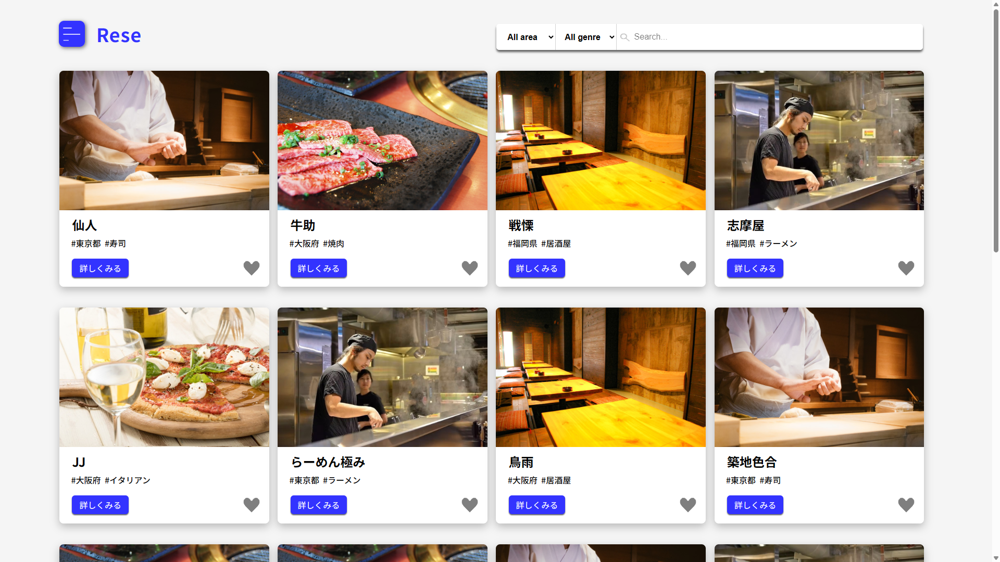

# Rese

飲食店予約サービス




## 作成した目的

外部の飲食店予約サービスは手数料を取られるので自社で予約サービスを持ちたい


## アプリケーションURL

| 該当画面                          | URL                                    |
| -------------------------------- | -------------------------------------- |
| 飲食店一覧 画面                   | http://localhost/                      |
| ログイン 画面                     | http://localhost/login/                |
| 店舗代表者 画面（ログインが必要）   | http://localhost/owner/shop/info/      |
| 管理者 画面（ログインが必要）       | http://localhost/admin/owner/create/   |
| phpMyAdmin                       | http://localhost:8080/                 |
| MailHog                          | http://localhost:8025/                 |


## テストアカウント

### 一般ユーザーアカウント

Email: user@example.com  
Password: password  

### 店舗代表者アカウント

Email: owner1@example.com  
Email: owner2@example.com  
Email: owner3@example.com  
…  
Email: owner20@example.com  

Password: ownerpass  

> 20名存在します。  
> いずれも共通パスワードです。  

### 管理者アカウント

Email: admin@example.com  
Password: adminpass  


## 機能一覧

### 認証

- 会員登録
- メール認証
- ログイン
- ログアウト

### 一般ユーザー

- 飲食店一覧の表示
- 飲食店詳細の表示

- 飲食店のお気に入り登録
- 飲食店のお気に入り解除

- 飲食店の予約
- 飲食店のレビュー（予約来店後）
- 予約内容の変更
- 予約キャンセル

- ユーザー情報の表示
- ユーザー予約情報一覧の表示
- ユーザーお気に入り飲食店一覧の表示

- 飲食店エリア検索
- 飲食店ジャンル検索
- 飲食店名検索

### 店舗代表者

- 店舗情報の作成
- 店舗情報の更新

- 予約情報一覧の表示
- 予約の来店確認処理

### 管理者

- 店舗代表者の作成
- 店舗代表者情報一覧の表示
- 店舗代表者の削除


## 使用技術

- PHP 8.1.33
- Laravel 8.83.8
- MySQL 8.0.26
- Nginx 1.21.1
- MailHog（開発環境でのメール送信確認）


## テーブル設計

### usersテーブル

| カラム名           | 型              | PRIMARY KEY | UNIQUE KEY | NOT NULL | FOREIGN KEY |
| ----------------- | --------------- | ----------- | ---------- | -------- | ----------- |
| id                | unsigned bigint |      〇     |            |    〇    |             |
| name              | varchar(20)     |             |            |    〇    |             |
| email             | varchar(255)    |             |     〇     |    〇    |             |
| email_verified_at | timestamp       |             |            |          |             |
| password          | varchar(255)    |             |            |    〇    |             |
| role              | tinyint         |             |            |    〇    |             |
| remember_token    | varchar(100)    |             |            |          |             |
| created_at        | timestamp       |             |            |    〇    |             |
| updated_at        | timestamp       |             |            |    〇    |             |
| deleted_at        | timestamp       |             |            |          |             |

### shopsテーブル

| カラム名     | 型              | PRIMARY KEY | UNIQUE KEY | NOT NULL | FOREIGN KEY |
| ----------- | --------------- | ----------- | ---------- | -------- | ----------- |
| id          | unsigned bigint |      〇     |            |    〇    |             |
| user_id     | unsigned bigint |             |            |    〇    | users(id)   |
| name        | varchar(50)     |             |            |    〇    |             |
| region      | varchar(50)     |             |            |          |             |
| genre       | varchar(50)     |             |            |          |             |
| description | text            |             |            |    〇    |             |
| image       | varchar(255)    |             |            |    〇    |             |
| created_at  | timestamp       |             |            |    〇    |             |
| updated_at  | timestamp       |             |            |    〇    |             |

### favoritesテーブル

| カラム名    | 型              | PRIMARY KEY       | UNIQUE KEY | NOT NULL | FOREIGN KEY |
| ---------- | --------------- | ----------------- | ---------- | -------- | ----------- |
| user_id    | unsigned bigint | user_id + shop_id |            |    〇    | users(id)   |
| shop_id    | unsigned bigint | user_id + shop_id |            |    〇    | shops(id)   |
| created_at | timestamp       |                   |            |    〇    |             |
| updated_at | timestamp       |                   |            |    〇    |             |

### reservationsテーブル

| カラム名     | 型              | PRIMARY KEY | UNIQUE KEY | NOT NULL | FOREIGN KEY |
| ----------- | --------------- | ----------- | ---------- | -------- | ----------- |
| id          | unsigned bigint |      〇     |            |    〇    |             |
| user_id     | unsigned bigint |             |            |    〇    | users(id)   |
| shop_id     | unsigned bigint |             |            |    〇    | shops(id)   |
| date        | date            |             |            |    〇    |             |
| time        | time            |             |            |    〇    |             |
| people      | tinyint         |             |            |    〇    |             |
| status      | tinyint         |             |            |    〇    |             |
| rating      | tinyint         |             |            |    〇    |             |
| comment     | text            |             |            |          |             |
| created_at  | timestamp       |             |            |    〇    |             |
| updated_at  | timestamp       |             |            |    〇    |             |
| canceled_at | timestamp       |             |            |          |             |


## ER 図


## 環境構築

### Docker ビルド

1. 以下のコマンドでリポジトリをクローンし、Docker コンテナをビルドして起動する。

```bash
git clone git@github.com:some-git-hub/rese.git
cd rese
docker-compose up -d --build
```

> MySQL は OS によって起動しない場合があるため、  
> それぞれの PC に合わせて「docker-compose.yml」を編集してください。

### Laravel 環境構築

1. 依存パッケージをインストールし、環境ファイルを作成する。

```bash
docker-compose exec php bash
composer install
cp .env.example .env
```

2. 「.env」に以下の環境変数を追記する。

```text
DB_CONNECTION=mysql
DB_HOST=mysql
DB_PORT=3306
DB_DATABASE=laravel_db
DB_USERNAME=laravel_user
DB_PASSWORD=laravel_pass
```

3. アプリケーションキーを生成し、DB 初期化を実行する。

```bash
php artisan key:generate
php artisan migrate --seed
```

4. 画像アップロードに必要なストレージリンクを作成する。

```bash
php artisan storage:link
```

### MailHog 環境構築

1. 「.env」に以下の環境変数を追記する。

```text
MAIL_MAILER=smtp
MAIL_HOST=mailhog
MAIL_PORT=1025
MAIL_USERNAME=null
MAIL_PASSWORD=null
MAIL_ENCRYPTION=null
MAIL_FROM_ADDRESS=rese@example.com
MAIL_FROM_NAME="Rese"
```

2. http://localhost:8025 にアクセスすると、  
開発環境でメール送信を確認できる(会員登録時のメール認証)。

> MailHog は開発環境専用のメールキャプチャツールで、  
> 送信したメールは外部に送られず MailHog 内でのみ確認できます。


## 補足

### 予約フォームの初期値

| 項目 　　　　　　　　 | 初期値 　　　　　　　　　　　 |
| ------------------- | --------------------------- |
| 予約日 　　　　　　　 | 当日 　　　　　　　　　　　　 |
| 予約時間 　　　　　　 | 17:00 　　　　　　　　　　　 |
| 予約人数 　　　　　　 | 2名 　　　　　　　　　　　　 |